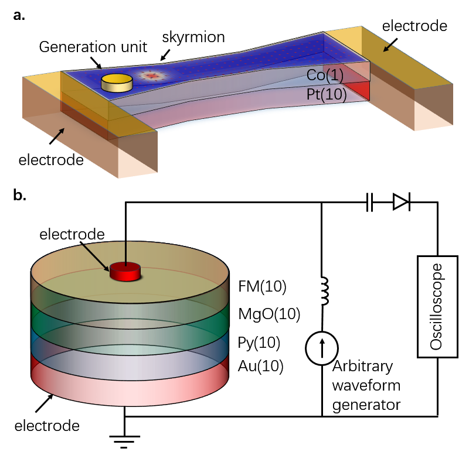
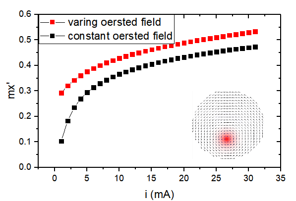
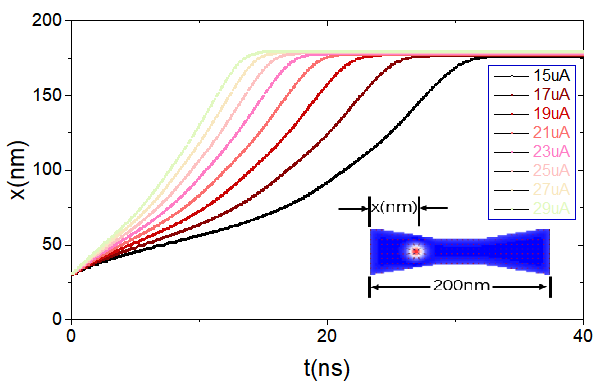
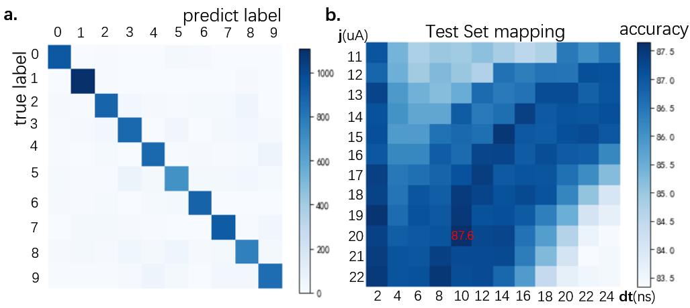
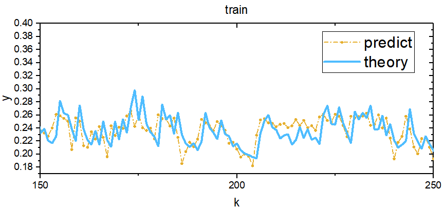
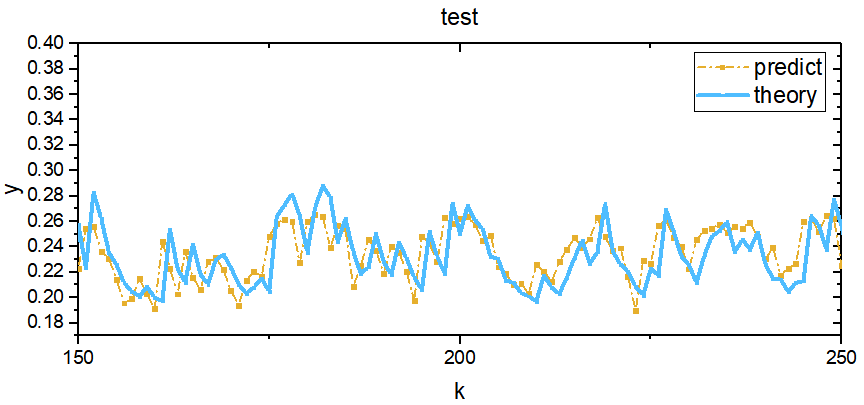

# Reservoir computing using spin oscillator for temporal information processing

## Abstract

We propose a reservoir computing system containing skyrmion strips and spintronics nano oscillator for process image classification task and non-linear time sequence prediction task. We present a numerical simulation study on the reservoir computing based on spintronics device.

#####  keywords: spin-oscillator, skyrmion, reservoir computing, simulation

## 1. Introduction
Neuromorphic computing paradigm, has attracted considerable attention recently, which is very effective in cognition- and perception- related tasks. Although neural network has achieve many success, but it need huge computing power. Reservoir computing is a algorithm-based way to reduce computational power, and there are also many hardware-based way can reduce computational power. In recent years, a variety of nano-electronic devices have been proposed to build reservoir neural network, such as phase-change memories [1], memristors[2,3,4], spintronics nano-oscillator[5], etc, offering new opportunities for neuromorphic computing hardware design.

Reservoir computing systems utilize dynamic reservoirs having short-term memory to project features from the temporal inputs into a high-dimensional space, it is effective processing time-varying inputs.[6] RC system can be considered into two parts: the first part, connected to the input, is called the "reservoir". The neurons in the reservoir will evolve dynamically with the temporal input signals, the weight in reservoir networks is fixed, this part requiring no training. The second part connected to the input, it is also called the readout function, which is typically simple (very easy to train). The reservoir part maps the input u(t) to a new high-dimensional space represented by r(t) and performs a nonlinear transformation of the input. We also say the r(t) representing the state of the reservoir.[3] The projected features r(t) can be effectively analyzed by a readout function layer. The system can efficiently compute complex and temporal data with low-training cost, since only the readout function needs to be trained.

Magnetic skyrmion is a kind of nanoscale magnetic textures, it is well suitable for information process, owing to their particle-like behaviors, small size, low driving current density and topologically stability[7]. Skyrmion strip have been shown to be able to emulate synaptic functions by storing analog synaptic weights and thus modulate the connection strength between the input and output neurons[8,9]. This may enable us to design new neuromorphic devices with functionality that may be inaccessible to conventional electronic devices.

Nanoscale spintronic oscillators are nanoscale pillars composed of two ferromagnetic layers separated by a non-magnetic spacer (Fig.1). Charge currents become spin-polarized when they flow through these junctions and generate a torque on the magnetizations that lead to sustained magnetization precession at frequencies of hundreds of megahertz to several tens of gigahertz. Magnetization oscillations are converted into voltage oscillations through magneto-resistance[10]. The resulting radio-frequency oscillations, of up to tens of millivolts, can be detected by measuring the voltage across the junction.[11]

The compact device structure and the ability to both store and process information at the same physical locations make spintronic oscillators and other spintronics device attractive candidates for neuromorphic computing applications. Recent experiment studies have also demonstrated that these devices can even emulate a 400 neurons network based on internal spin dynamics[5]. In this work, we propose that reservoir computing systems containing spintronics oscillator and skyrmion strip that can be used to process information. And we carry out numerical simulation studies on spintronics oscillator and  skyrmion strip to mapping a reservoir computing system to solve two demo tasks, which are handwritten digit recognition and time series prediction.

**Fig.1 a.** Schematic of a spintronics oscillator, consisting of a free layer(Py) between two ferromagnetic layers. The current is injected into the oscillator, which induces magnetization precessions of the magnetization in free layer. The diameters of spintronics oscillator can be 10~500nm. As the schematic of the experimental set-up, the a.c. voltage emitted by the oscillator can be measured. **b.** the skyrmion strip, it is dumbbell-shaped, two layers. The length of skyrmion strip is 200nm, the width is 60nm.

## 2. Methods
### 2.1 skyrmion nano strip

The nano strip is designed with a default dimension of 200 nm × 60 nm × 1 nm. The default parameters in our simulations are chose for a Co/Pt thin-film system, adopted from [8]. The exchange stiffness is A = 15 pJ m-1, and the Dzyaloshinskii–Moriya interaction(DMI) is D = 3 mJ/m^3. saturation magnetization Ms = 580kA/m, Gilbert damping, α = 0.3. The Spin polarization rate, P = 0.4. The perpendicular magnetic anisotropy (PMA) value of the nano strip K1 is 0.7 MJ/m^3. A discretization size of 2 nm × 2 nm × 1 nm is used in our simulations.
It is worth noting that the nano strip are dumbbell-shaped, narrow in the middle and wide on both sides. The nonlinear distribution of current, the nonlinear boundary repulsive force field caused by this dumbbell shape makes skyrmion have nonlinear behavior. If the position of the skyrmion is defined as the output state, the state of device is naturally affected by the previous state. Then it forms a small RNN cell, for it has a nonlinear behavior and its state is affected by the previous state. Finally, the input information is defined as the current intensity, and then this RNN cell can be to process the information.

### 2.2 vortex oscillator
The nano-oscillator device is disc shaped, which is designed with a default dimension of 100 nm × 100 nm × 10 nm. The default parameters in our simulations are chose for a Py film system. The exchange stiffness is A = 13 pJ m-1. saturation magnetization Ms = 800kA/m, Gilbert damping, α = 0.01. The Spin polarization rate, P = 0.4. A discretization size of 2 nm × 2 nm × 2 nm is used in our simulations.

As can be seen from Figure 1, mx~  is defined as the envelope of the normalized magnetic moment component mx, and mx~ is taken as the output. This output has a nonlinear behavior with the input current. This can be qualitatively understood: as the applied current increases, the vortex's radius of motion expands, but the radius of motion is also affected by the boundary repulsive force field, thereby causing complex nonlinear behavior.

### 2.3 train the readout function
The readout function for handwritten digits image classification and second-order nonlinear sequence is a simple linear layer. It is easy to train, we use python to solve it.[see supplement material]

## 3. Results
### 3.1 nonlinear dynamics and the delay phenomenon
The spintronics nano oscillators used for this study are circular magnetic tunnel junctions, with a 10 nm thick Py free layer 100 nm in diameter, and a magnetic vortex as a ground state. We can inject a varying current to spintronics oscillator and skyrmion strip to study the nonlinear dynamics and the delay phenomenon. For spintronics nano oscillators, the delay phenomenon is obviously, but for skyrmion, the delay phenomenon may not be so obvious. We note that the goal is to make the device comply with the principle of reservoir computing. The theoretical requirements for reservoir computing are very loose: the reservoir is required to have fading memory[12], the reservoir is required to have nonlinear dynamics. The fading memory, means short-term memory, which is achieved by feedback ("recurrent") loops in their synaptic connection pathways in artificial neural networks.[ Harnessing Nonlinearity , science ] For a physical device, if a state can be defined and this state is related to the state at the previous moment, then it can be used for reservoir computing.[13]

**Fig.2  a.** In spintronics oscillator, the envelope of the normalized magnetic moment component mx is output, it varies nonlinearly with current. When we change the current, the oscillator of mx is gradually change, so the current state of the oscillator will be affected by the state of the past period of time, it comply with the principle of reservoir computing. **b.** In skyrmion strip, the position of skyrmion is output, it also varies nonlinearly with current. As for the skyrmion strip, we define the position of skyrmion is the output, the current position of skyrmion is naturally will be affected by the state of the past period of time, with nonlinear dynamics and the delay phenomenon, it also comply with the principle of reservoir computing.

### 3.2 a demo task: the image classification
We train and test the Reservoir Computing system(RC system) using MNIST dataset, which is a commonly used for image classification. This task is often used to detect the effects of new neural network structure in computer academia. The original image is 28*28, and is grayscale, we convert it to black and white image in the preprocessing stage.

**Fig. 3** Schematic of the image classification process in RC system. **a.**The image is first converted to a matrix whose shape is 196*4. Each row is encode into a 4bit current pule to meet the spintronics device input requirements(such as the current intensity input range requirements for spintronics device), and then inject current pules to the RC system containing 196 skyrmion strips. For each image we can get a 196 dimension vector, called it feature vector. **b.** Multiply the weight matrix and feature vector, after a nonlinear function, the relative probability vector get, the index of max value in relative probability vector represents the predicted digit of the RC system for the input image.

It should be noted that the preprocessing stage is important, as it reduce the difficulty of the problem, as a prior study[3]. As shown in the figure, the image is reshaped to 196*4, then each line is converted to a 4bit current pulse (with a pulse width) and then inject into one of the skyrmion strip cells in RC system. Each of which can pass through the reservoir and get a feature vector of 196 dimensions. In this process, the role of the RC system is to project pixel information of the image that has been encoded as temporal inputs to a high latitude space non-linearly, and the projection process may have a time lag. Thus, for a single image, we can get a 196-dimensional feature vector, then we add a fully-connected linear layer after the RC system, which is the general flow of RC. What we need to predict is a 10-dimensional relative probability vector, so the fully connected layer uses a sigma function to make the value range between 0 and 1. We note that although a nonlinear function sigma appears, this is still a linear layer, and it is easy to solve the optimal weight of the linear layer by a small batch random gradient descent method. We emphasize that this is the advantage of the RC system, which only needs to train the linear layer of the output, rather than training the entire deep neural network. Training the entire deep neural network typically takes a significant amount of time and expense.

We also call the 10 × 196 weight matrix readout network, it is trained using linear logistic regression, which is a simple work compare to multi-layer network. Using the RC system have a significant advantage, the reduction of network size and training cost. Because the reservoir part don't need any parameter or training, the readout function have a global optimal solution. It makes RC system(with linear readout function) much better trained than a deep network.

The parameters are all in the linear layer, the number of parameters is 1970(including 10 bias value), which is a small number compare to common neural network model. The image in MNIST dataset is grayscale, we convert it to binary images in preprocessing stage, this may lost a lot information. Even with these non-idealities, we note that the numerically results, with a much smaller network and dealing with a simplified, truncated image input, are already very close to the 88% accuracy achieved previously by simulation based on a one-layer neural network with 7850 parameters, using pixel values of the entire grayscale digit image as the input[14].

In training process, we use 55000 images from the MNIST data set, the image is fed into the RC system, then the readout function is trained. After training, another set of samples consisting of 10000 images not in the training set, are used to test the recognition accuracy. From the 10000 test images, an 87.6% accuracy was obtained from the RC system. Figure.4 shows the classification accuracy.

**Fig. 4  a.** the predict answer, for current is 20uA, pulse width is 10ns. **b.** The accuracy varies with current and pulse width. The best is 87.6%.

### 3.3 Solving a second-order nonlinear dynamic predict task
As shown in the previous example, the RC system can be applied to the classification of images, but RC system is more suitable to handle time series related tasks. we will use numerical methods to explore the ability of the spintronics oscillator to process time series below. To the best of our knowledge, no one has carried this kind of micro-magnetics numerically study on spintronics oscillator, so our numerically study the ability of spintronics oscillators to process time series may accelerate research in vortex-like spintronics oscillator.

**Fig.5** Schematic of the process of time series predict task process in RC system. The RC system is composed of 10 spintronics nano oscillators and 10 skyrmion strips. The above part in figure, the random input is feed to the formulas, the output will be generated. Another part, the random input is feed to the RC system, we can get several curves, then we weighted linear superposition these curves, and the prediction is get. After we have trained the weight coefficients of the linear superposition, the predicted values of the RC system can be close to the theoretical values for any random input.

We show another task, where the RC system is used to solve a second-order dynamic nonlinear task. Nonlinear dynamical systems are commonly exist in electrical, mechanical, control, and other engineering fields. Among which, second-order nonlinear dynamic systems are widely studied as a model system because of their close relations to electrical systems. Figure.5 shows the process schematic of time series predict task process in RC system, which can imitate a second-order nonlinear system dynamics. For a given input u(k) at timeframe k, the system generates an output y(k) following a nonlinear transfer function that may have a time lag. In our simulation, we choose a second-order equation following a prior study[3], described as:
〖y(k)=0.4y(k-1)+0.4y(k-1)y(k-2)+u^2 (k)〗^ +0.1

In reality applications, the relationship between y(k) and u(k) is hidden, which makes the problem difficult to analysis solve, even this kind of recursion formula may not know, usually we only know the history data of a reality applications. In this case, we can only solve it based on the data already recorded. An attempt to solve this problem with a conventional network shows large error for both the training and testing data[3]. Since each output y(k) is dependent on the recent past results but not on the far past, this problem is well suited for RC systems such as the presented above, the RC system may work well. The RC system containing 10 skyrmion-based spintronics devices and 10 vortex-based spintronics devices will map the input u(k) into 20 kinds of curve, we called feature curve. The predict y(k) is just the weighted summation of feature curve. After training, the weights get, we can get the predict y(k) from any random input u(k) without knowing the original expression of u(k) and y(k). We use a 300 timeframe-long random sequence as inputs to train the RC system. The 10 skyrmion strips spintronics devices are feed with 10 different timeframe widths (3ns, 5ns, 7ns, 9ns, 11ns, 13ns, 15ns, 17ns, 19ns, 21ns), the 10 spintronics oscillator neuron devices are feed with 5 different timeframe widths (5ns, 7ns, 9ns, 11ns, 13ns, 13ns, 15ns, 17ns, 19ns, 21ns). We use two kinds of spintronics device to help increase the diversity and nonlinear, the different timeframe widths are used to make the reservoir output more separable. These methods may have many benefits for the performance of the RC system[3].

**Fig.6** After the 300 timeframe-long random sequence is feed into the RC system, we can get 20 curves, each with 300 points. We define the output is a 20-dimensional vector, we say the RC system map the scalar input into a high dimension space, and the vector in high dimension space have complex dynamics due to the complex dynamic behavior of internal magnetic moments in spintronic devices. The output can be seen a 300 timeframe-long signal, the element is 20-dimensional vector. Then we train a 1×20 weight matrix, the predicted curves y(k) was got by weighting summation of 20 curves. **a.**the train error **b.**the test error.

Figure.6 show the numerically obtained reconstructed outputs from the skyrmion-based and vortex-based RC system after training(red solid line), and the theoretical output y(k) (black solid line) from the training sequence, showing the RC system can correctly solve the dynamic nonlinear problem, with a normalized mean squared error (NMSE, Methods section) of 2.83 × 10-3. More importantly, to verify the spintronics device RC system has indeed solved the second-nonlinear dynamic transfer function, we tested the system using two new, independently generated random sequence other than the training sequence. Figure.5.b shows that the system is still able to successfully predict the expected dynamic output for the random, untrained sequence using the same readout function, with a similar NMSE of 2.82 × 10-3.

## 4. Discussion
In this study, we demonstrate a RC system contain of 196 skyrmion-based neuron devices can be used to process real world problems such as handwritten digit recognition with performance comparable to those achieved in much larger networks. We also show that even a small RC system consisting of 20 spintronics devices can be used to predict second-nonlinear time series without knowing the form of the recursion function. The normalized mean squared error is about 3e-3 order of magnitude, which can be compare to the recent study[3], a RC system containing 90 memristors. The size of RC system used to predict second-order nonlinearities is much small compare with which used in image classification, it can be qualitatively understood as the RC system is more suitable for time series as we have noted. Compared to [3], our spintronics-based RC system is smaller(the number of cells is 20), and can get slightly better prediction, and the spintronics-based device is faster.

It should be  noted that RC system can be optimized for image classification, such as removing image edge pixels during preprocessing, using more skyrmion-based devices, using two or more pulse times and so on[3]. We didn't do it because we think in cognitive task, the less human work, the better.

It should be  noted that RC system can be optimized for second-nonlinear dynamic task, such as add more spin-oscillator device into the RC system. This can be see in [3], the prediction is getting better with the number of memristors. The reason may be that the more cells in the reservoir, the more the characteristics of the sequence can be captured.

We finally note that the spintronics devices are suitable for integration with existing CMOS technology, the spintronic devices generally have low power consumption, and typically reach GHz speeds. The antiferromagnetic spintronics devices are expected to reach THz operating frequencies. The spintronics-based RC system can continue development to more complex network toward broad applications in areas, such as prediction, speech analysis and image captioning. Our simulation work may provide some ideas for future applications of spintronics in neural networks.

## Acknowledgements
xxxxxxxxxxxxxxxxxxxxxxxxxxxxxxxxxxxxxxxxxxxxxxxxxxxxxxxxxxxxxxxxxxxxxxxxxxxxxxxxxxxxxxxxxxxxxxxxxxxxxxxxxxxxxxxxxxxxxxxxxxxxxxxxxxxxxxxxxxxxxxxxxxxxxxxxxxxxxxxxxxxxxxxxxxxxxxxxxxxxxxxxxxxxxxxxxxxxxxxxxxxxxxxxxxxxxxxxxxxxxxxxxxxxxxxxxxxxxxxxxxxxxxxxxxxxxxxxxxxxxxxxxxxxxxxxxxxxxxxxxxxxxxxxxxxxxxxxxxxxxxxxxxxxxxxxxxxxxxxxxxxxxxxxxxxxxxxxxxxxxxxxxxxxxxxxxxxxxxxxxxxxxxxxxxxxxxxxxxxxxxxxxxxxxxxxxxxxxxxxxxxxxx.

## References
1. Eryilmaz, S. B. et al. Brain-like associative learning using a nanoscale non-volatile phase change synaptic device array. Front. Neurosci. 8, 205 (2014)
2. Prezioso, M. et al. Training and operation of an integrated neuromorphic network based on metal-oxide memristors. Nature 521, 61 (2015)
3. Du, C. et al. Reservoir computing using dynamic memristors for temporal information processing. Nature Communications 8, 2204 (2017).
4. Sheridan, P. M. et al. Sparse coding with memristor networks. Nature Nanotechnology 12, 784 (2017).
5. Torrejon, J. et al. Neuromorphic computing with nanoscale spintronic oscillators. Nature 547, 428 (2017).
6. Jaeger, H. & Haas, H. Harnessing Nonlinearity: Predicting Chaotic Systems and Saving Energy in Wireless Communication. Science 304, 78–80 (2004).
7. R. H. Liu, W. L. Lim, and S. Urazhdin, Dynamical skyrmion state in a spin current nano-oscillator with perpendicular magnetic anisotropy, Phys. Rev. Lett. 114,137201(2015).
8. Li, S. et al. Magnetic skyrmion-based artificial neuron device. Nanotechnology 28, 31LT01 (2017).
9. Huang, Y., Kang, W., Zhang, X., Zhou, Y. & Zhao, W. Magnetic skyrmion-based synaptic devices. Nanotechnology 28, 08LT02 (2017).
10. Pribiag, V. S. et al. Magnetic vortex oscillator driven by d.c. spin-polarized current. Nature Physics 3, 498–503 (2007).
11. R. H. Liu, W. L. Lim, and S. Urazhdin, Spectral characteristics of the microwave emission by the spin Hall nano-oscillator, Phys. Rev. Lett. 110, 147601(2013).
12. Paquot, Y. et al. Optoelectronic Reservoir Computing. Scientific Reports 2, 287 (2012).
13. Appeltant, L. et al. Information processing using a single dynamical node as complex system. Nature Communications 2, 468 (2011).
14. LeCun, Y., Bottou, L., Bengio, Y. & Haffner, P. Gradient-based learning applied to document recognition. Proc. IEEE 86, 2278–2324 (1998)

