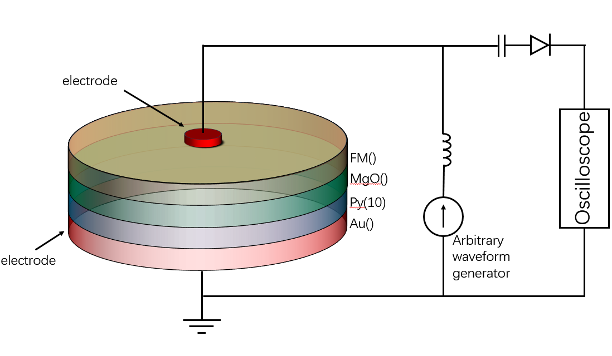
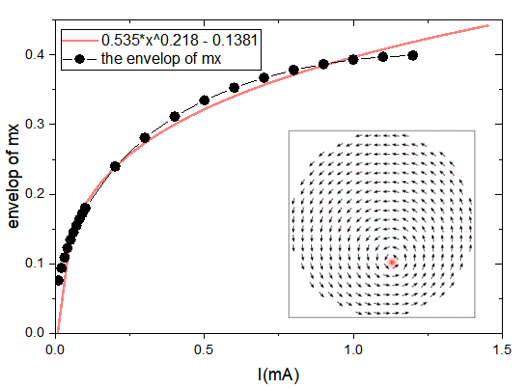
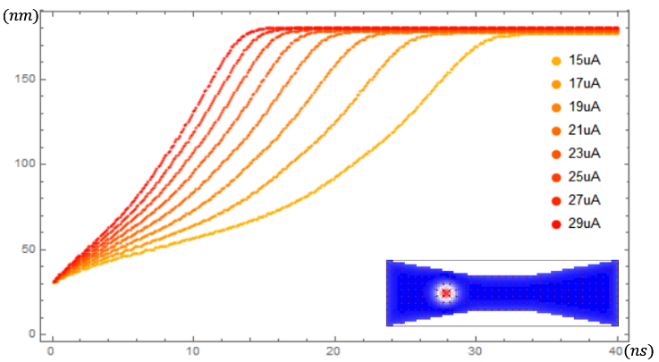
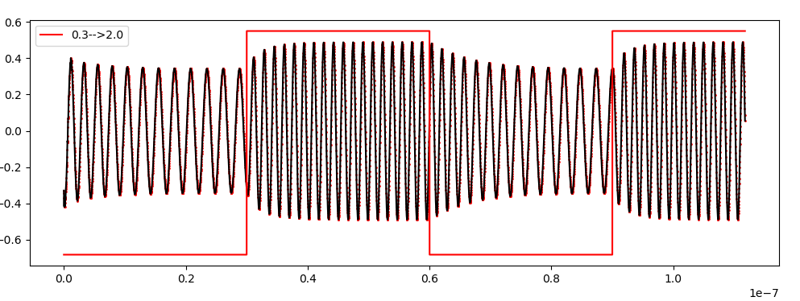
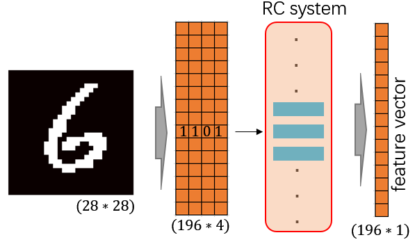
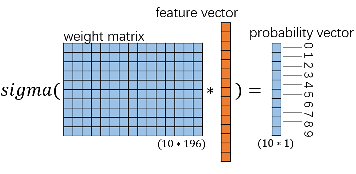
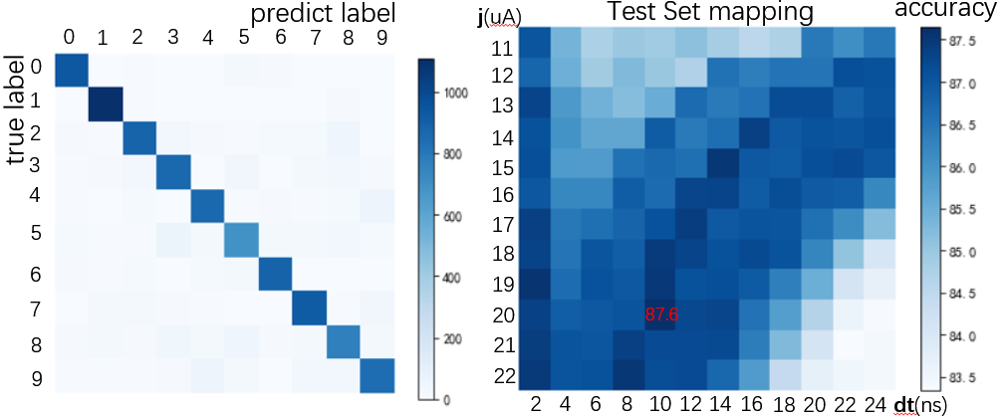
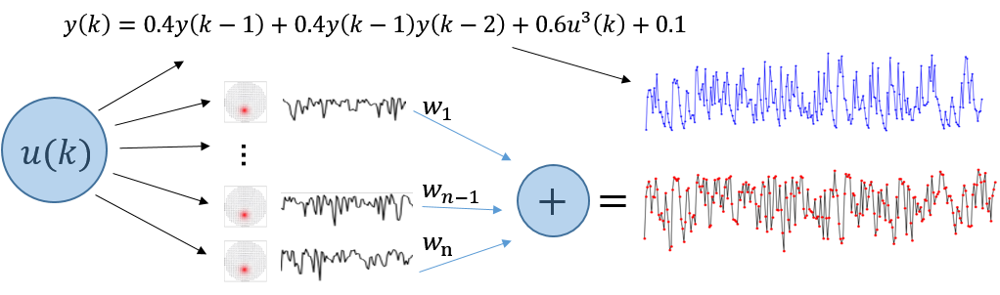
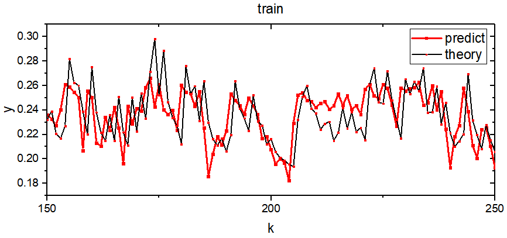
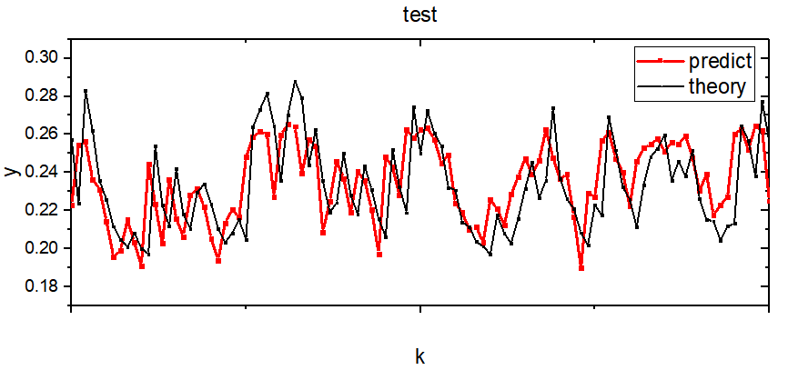

# Reservoir computing using spin oscillator for temporal information processing

## Abstract

xxxxxxxxxxxxxxxxxxxxxxxxxxxxxxxxxxxxxxxxxxxxxxxxxxxxxxxxxxxxxxxxxxxxxxxxxxxxxxxxxxxxxxxxxxxxxxxxxxxxxxxxxxxxxxxxxxxxxxxxxxxxxxxxxxxxxxxxxxxxxxxxxxxxxxxxxxxxxxxxxxxxxxxxxxxxxxxxxxxxxxxxxxxxxxxxxxxxxxxxxxxxxxxxxxxxxxxxxxxxxxxxxxxxxxxxxxxxxxxxxxxxxxxxxxxxxxxxxxxxxxxxxxxxxxxxxxxxxxxxxxxxxxxxxxxxxxxxxxxxxxxxxxxxxxxxxxxx

#####  keywords: spin-oscillator, skyrmion, reservoir computing, simulation

## 1. Introduction

Neuromorphic computing paradigm, has attracted considerable attention recently, which is very effective in cognition- and perception- related tasks. Althoug neural network has achieve many success, but it need huge computing power. Reservoir computing is a algorithm-based way to reduce computational power, and there are also many hardware-based way can reduce computational power. In recent years, a variety of nanoelectronic devices have been proposed to build reservoir neural network, such as phase-change memories [1], resistive memories[2], memristors[3], spintronics nano-oscillator[4], ect, offering new opportunitiesfor neuromorphic computing hardware design.

Rservoir computing systems utilize dynamic reservoirs having short-term memory to project features from the temporal inputs into a high-dimensional space, it is effective processing time-varying inputs. RC system can be considered into two parts: the first part, connected to the input, is called the "reservoir". The neurons in the reservoir will evolve dynamically with the temporal input signals, the weight in reservoir networks is fixed, this part requiring no training. The second part connected to the input, it is also called the readout function, which is typically simple (very easy to train). The reservoir part maps the input u(t) to a new high-dimensional space represented by r(t) and performs a nonlinear transformation of the input. We also say the r(t) representing the state of the reservoir. The projected features r(t) can be effectively analyzed by a readout function layer. The system can efficiently compute complex and temporal data with low-training cost, since only the readout function needs to be trained.

Magnetic skyrmion is a kind of nanoscale magnetic spintextures, it is well suitable for information process, owing to their particle-like behaviors, small size, low driving current density and topologically stability. Vortex-like oscillator was used to consider to be used in the microwave field, but last year there is already a experiments which implement reservoir computing using vortex-like oscillator. This may enable us to design new neuromorphic devices with functionality that may be inaccessible to conventional electronic devices.

Nanoscale spintronic oscillators (or spin-torque nano-oscillators) are nanoscale pillars composed of two ferromagnetic layers separated by a non-magnetic spacer (Fig.1). Charge currents become spinpolarized when they flow through these junctions and generate torques on the magnetizations that lead to sustained magnetization precession at frequencies of hundreds of megahertz to several tens of gigahertz. 

Magnetization oscillations are converted into voltage oscillations through magneto-resistance. The resulting radio-frequency oscillations, of up to tens of millivolts (ref. 12), can be detected by measuring the voltage across the junction. Spin-nano-oscillators are therefore simple and ultra-compact: their lateral size can be scaled down to 10nm.

The compact device structure and the ability to both store and process information at the same physical locations make spintronic oscillators and other spintronics device attractive candidates for neuromorphic computing applications. spin oscillator have been shown to be able to emulate synaptic functions by storing analog synaptic weights and thus modulate the connection strength between the input and output neurons. Recent studies have also demonstrated that these devices can even emulate a 400 neurons network based on internal spin dynamics. In this work, we also propose a skyrmion-based neuron device. And we carry out numerical simulation studies on spintronics oscillator and  skyrmion nanotracks to mapping a reservoir computing system, then we show that the internal skyrmion and vortex dynamic processes of spintronics device allow the spintronics-based reservoir to directly process information for handwritten digit recognition and time series predict task.

And although we focus on reservoir computing, we expect that other machine learning techniques, e.g., deep learning, might also be useful for the task we address.

**Fig.1  a.** Schematic of a spintronics oscillator, consisting of a free layer(Py) between two ferromagnetic layers. The current is injected into the oscillator, which induces magnetization precessions of the magnetization in free layer. The diameters of spintronics oscillator can be 10~500nm. As the schematic of the experimental set-up, the a.c. voltage emitted by the oscillator can be measured. **b.** the skyrmionstrip, it is dumbbell-shaped, two layers. The length of skyrmionstrip is 200nm, and the width is 60nm.

## 2. Methods
### 2.1 skyrmion nanotrack
The nanotrack is designed with a default dimension of 200 nm × 60 nm × 1 nm. The default parameters in our simulations are chose for a Co/Pt thin-film system, adopted from [25]. The exchange stiffness is A = 15 pJ m-1, and the Dzyaloshinskii–Moriya interaction(DMI) is D = 3 mJ/m^3. Sat. magnetization, Ms = 580kA/m, Gilbert damping, α = 0.3. The Spin polarization rate, P = 0.4. The perpendicular magnetic anisotropy (PMA) value of the nanotrack K1 is 0.7 MJ/m^3. A discretization size of 2 nm × 2 nm × 1 nm is used in our simulations.
It is worth noting that the nanotrack are dumbbell-shaped, narrow in the middle and wide on both sides. The nonlinear boundary repulsive force field caused by this dumbbell shape makes skyrmion have nonlinear behavior. If the position of the skyrmion is defined as the output state, the state of device is naturally affected by the previous state. Then it forms a simple RNN model, it has a nonlinear behavior and its state is affected by the previous state. Finally, the input information is defined as the current intensity, and then this RNN model is used to process the information.

### 2.2 vortex oscillator
The nano-oscillator device is disc shaped, which is designed with a default dimension of 100 nm × 100 nm × 10 nm. The default parameters in our simulations are chose for a Py film system, adopted from [6]. The exchange stiffness is A = 13 pJ m-1. Sat. magnetization, Ms = 800kA/m, Gilbert damping, α = 0.01. The Spin polarization rate, P = 0.4. A discretization size of 2 nm × 2 nm × 2 nm is used in our simulations.

As can be seen from Figure 1, mx~   is defined as the envelope of the magnetic moment mx, and  mx~   is taken as the output. This output has a nonlinear behavior. This can be qualitatively understood: as the applied current increases, the vortex's radius of motion expands, but the radius of motion is also affected by the boundary repulsive force field, thereby causing this nonlinear behavior.

### 2.3 train the readout function
The readout function for handwritten digits image classification is a single-layer linear Logistic Regression as the output must fall between 0 and 1. The readout function for second-order nonlinear dynamic task is a linear superposition function, it is a simpler function. Both readout functions are linear and easy to train. We use python to solve it.[supplement matrial]

## 3. Results
### 3.1 nonlinear dynamics and the delay phenomenon
The nanoscale oscillators used for this study are circular magnetic tunnel junctions, with a 15 nm thick Py free layer 300 nm in diameter, and a magnetic vortex as a ground state. We can inject a varying current to spintronics oscillator and skyrmionstrip to study the nonlinear dynamics and the delay phenomenon.

**Fig.2  a.** In spintronics oscillator, the envelope of the mx is output, it varies with current is nonlinear. When we change the current, the oscillator of mx is gradually change, so the current state of the oscillator will be affected by the state of the past period of time, it comply with the principle of reservoir calculation. **b. ** In skyrmionstrip, the position of skyrmion is output, it also varies with current is nonlinear. As for the skyrmionstrip, we have defined the position of skyrmion is the output, the current position of skyrmion is natutally will be affected by the state of the past period of time, with nonliear dynamics and the delay phenomenon, it also comply with the principle of reservoir calculation. **c. ** the record of mx in spintronics oscillator.

### 3.2 a demo task: the image classification
We train and test the Reservoir Computing system(RC system) using MNIST dataset, which is a commonly used for image classification. The original image is 28*28, and is grayscale, we convert it to black and white picture.

**Fig. 3** Schematic of the process in RC system. The image is first converted to a matrix whose shape is 196*4. Then we inject it to a RCsystem containing 196 skyrmionstrips. Each row is encode to a 4bit current pules and then inject to a skyrmionstrip.

Then the image is feed into RC system contain 196 skyrmion-based neuron devices, a 196-dimensional vector will appear pass the RC system, we call it feature vector. Then we multiply this vector by a 10*196 weight matrix to get a 10-dimensional prediction vector. Finnaly, through sigma function, this 10-dimensional vector is the relatively probability representing the predicted digit value of the input image, schematically illustrated in Figure.3. We also call the 10 × 196 weight matrix readout network, it is trained using linear logistic regression, which is a simple work compare to multi-layer network. Using the RC system have a significant advantage, the reduction of network size and training cost. Because the reservoir part don't need any parameter or training, the readout function have a global optimal solution. It makes RC system(with linear readout function) much better trained than a deep network.

In training process, we use 55000 images from the MNIST data set, the image is fed into the RC system, then the readout function is trained. After training, another set of samples consisting of 10000 images not in the training set, are used to test the recognition accuracy. From the 10000 test images, an 87.6% accuracy was obtained from the RC system. Figure.4 shows a false color confusion matrix highlighting the numerically obtained classification results from the RC system vs. the true outputs.

The number of parameter is 1960, and the parameter is linear connect to output, and simulation can not get the true output voltage, the mx oscallator curve range is between 0 and 1, this may not big enough. We note that even with these non-idealities, the numerically results, with a much smaller network and dealing with a simplified, truncated input, are already very close to the 88% accuracy achieved previously by simulation based on a one-layer neural network with 7850 free parameters, using pixel values of the entire digit image as the input.

**Fig. 4  a.** the predict answer, for current is 20uA, pule width is 10ns. **b.** The accuracy varies with current and pulse width. The best is 87.6%.

### 3.3 Solving a second-order nonlinear dynamic task
As shown in the previous example, the RC system can be applied to the classification of pictures, but RC system is more suitable to handle time series related tasks. As shown in the previous experiment, the spintronics oscillator is used to process the audio signal (time series). Below we will use numerical methods to explore the ability of the spintronics oscillator to process time series. To the best of our knowledge, no one has carried this kind of numerically study on spintronics oscillator, so our numerically study the ability of spintronics oscillators to process time series may have accelerate research in vortex-like spintronics oscillator.

**Fig.5** Schematic of the process of time series predict task process in RC system. The RC system is composed of 10 spin nano oscillators and 10 skyrmionstrip. It have two parts. The first part, the random input is feed to the formulas, the output will be generated. As for second part, the random input is feed to the RC system, we can get server curve, then we weighted linear sum these curves.

We show another experiment, where the RC system is used to solve a second-order dynamic nonlinear task. Nonlinear dynamical systems are commonly exist in electrical, mechanical, control, and other engineering fields. Among which, second-order nonlinear dynamic systems are widely studied as a model system because of their close relations to electrical systems. Figure.5 shows the process schematic of time series predict task process in RC system, which can map a second-order nonlinear system dynamics. For a given input u(k) at timeframe k, the system generates an output y(k) following a nonlinear transfer function that may have a time lag. In our simulation, we choose a second-order dynamic nonlinear transfer function following a prior study[33], described as:
〖y(k)=0.4y(k-1)+0.4y(k-1)y(k-2)+u^2 (k)〗^ +0.1

In typical applications, the relationship between y(k) and u(k) is hidden, which makes the problem difficult to analysis solve, and this recursion formula may not know. In this case, we can only use it based on the data already recorded. An attempt to solve this problem with a conventional network shows large error for both the training and testing data[ ]. But the RC system may work well. The RC system contain 10 skyrmion-based neuron devices and 10 vortex-based neuron devices will map the input u(k) into 20 kinds of curve, we called feature curve. The output y(k) is just the weighted summation of feature curve. After training, the weights get, we can get y(k) from any random input u(k) without knowing the original expression between u(k) and y(k). Since each output y(k) is dependent on the recent past results but not on the far past, this problem is well suited for RC systems such as the presented above. We use a 300 timeframe-long random sequence as inputs to train the RC system. The 10 skyrmionstrip neuron devices are feed with 10 different timeframe widths (3ns, 5ns, 7ns, 9ns, 11ns, 13ns, 15ns, 17ns, 19ns, 21ns), the 10 spintronics oscillator neuron devices are feed with 5 different timeframe widths (5ns, 7ns, 9ns, 11ns, 13ns, 13ns, 15ns, 17ns, 19ns, 21ns). We use two kinds of spintronics device to help increase the nonlinear, the different timeframe widths are used to make the reservoir output more separable.[]

**Fig.6** 

After the 300 timeframe-long random sequence is feed into the RC system, we can get 20 curves, each with 300 points. If we define the output is a 20-dimensional vector, the output can be seen a 300 timeframe-long singal, the element is 20-dimensional vector. Then we train a 1×20 weight matrix, linearly add 20 curves with weight matrix to get the predicted curves y(k). Figure.6 show the numerically obtained reconstructed outputs from the skyrmion-based and vortex-based RC system after training(red solid line), and the theoretical output y(k) (black solid line) from the training sequence, showing the RC system can correctly solve the dynamic nonlinear problem, with a normalized mean squared error (NMSE, Methods section) of 3.21 × 10-3. More importantly, to verify the spintronics device RC system has indeed solved the dynamic transfer function, we tested the system using three new, independently generated random sequence other than the training sequence. Figure.6 shows that the system is still able to successfully predict the expected dynamic output for the random, untrained sequence using the same readout function, with a similar NMSE of 3.11 × 10-3, 2.91 × 10-3, 3.21 × 10-3.(we show one of three cases in picture)

## 4. Discussion
In this study, we demonstrate a RC system contain of 196 skyrmion-based neuron devices can be used to process real world problems such as handwritten digit recognition with performance comparable to those achieved in much larger networks. We also show that even a small RC system consisting of 20 spintronics devices can be used to predict second-nonliner time series without knowing the form of the recursion function. The normalized mean squared error is about 3e-3 order of magnitude, which can be compare to the recent study, a RC system contain 88 memristors.

The size of RC system used to predict second-order nonlinearities is small compare with which used in image classfication, it can be qualitatively understood as the RC system is more suitable for time series. Compared to [], our RCsystem smaller predictions are more accurate and faster. And we note that RC system can be optimized for image classification, such as removing image edge pixels during preprocessing, using more skyrmion-based devices, using two or more pulse times and so on. But we think in human cognitive task, the less human work, the better.

We also note that the spintronics simulation work in may 

## Acknowledgements
Proin pharetra nonummy pede. Mauris et orci. Aenean nec lorem. In porttitor. Donec laoreet nonummy augue. Suspendisse dui purus, scelerisque at, vulputate vitae, pretium mattis, nunc. Mauris eget neque at sem venenatis eleifend. Ut nonummy.

## References

[1]	Surname A, Surname B and Surname C 2015 Journal Name 37 074203
[2]	Surname A and Surname B 2009 Journal Name 23 544

[3]    

