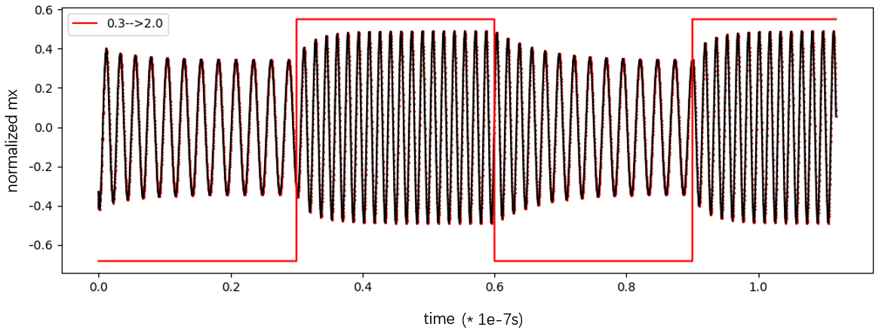

# Supplementary Material

## skyrmion strip and spin-oscillator

**Fig.S1** The spintronics oscillator, the normalized mx change nonlinear with the current with a time lag.

## find the weight matrix in image classification

When a 28*28 image is processed by the reservoir system, we can get a 192-dimensional vector x. We need to find the best weight matrix W and offset b such that sigma(W**x+b) is the relative probability of the number corresponding to the image. The loss function is as

$J(\theta)=\frac{1}{m}*\sum _{i=1}^m \left[-\log  \left(\left(1-y^i\right)\right) \left(1-h_{\theta } x^i\right)-\log  \left(y^i\right) \left(h_{\theta } x^i\right)\right]$

$h(\theta*x)=g\left(\theta ^T*x\right)$

$g(z)=\frac{1}{1+e^{-z}}$

where m is the number of samples, $ y^\left( i \right) $ is the desired output for input for $x^\left( i \right)$.

This is a generalized linear model solving problem, and the optimal weighting value can be solved by a small batch random gradient descent method.

$ \frac{\partial J\left(\theta\right)}{\partial \theta _j}=\frac{1}{m}*\sum _{i=1}^m \left[h_{\theta } x^i-y^i\right]*x_j^i $

The training of weights is achivevd in python module sklearn.

## find the weight matrix in second-nonlinear series prediction

Predicting a second-order nonlinear sequence is a time-series task that is well suited for processing with a reservoir system. For a random input of 300 points ( u(1), u(2), ... ), the analytical solution has solutions ( y(1), y(2), ... ). There are a total of 20 such input and analytical solutions, denoted by u_ji and y_ji, i = 1, 2, 3, ... 300, j = 1, 2, ... 20. For each segment of random input u_j, the reservoir system can derive a curve r_j, we need to find the best weight so that the predicted value y_predict(i) = wj*r_ji is closest to the true value.

The solution of this optimal weight is a generalized linear model problem, the loss function is as

$ J\left(\theta\right)=\frac{1}{2 m}*\sum _{i=1}^m \left[x^i \theta ^T-y^i\right]$

We can use the small batch random gradient descent algorithm to solve the optimal weight value.

$ \frac{\partial J(\theta)}{\partial \theta _j}=\frac{1}{m}\sum _{i=1}^m \left[x^i \theta ^T-y^i\right]*x_j^i $

The training of weights is achieved in python module sklearn.

